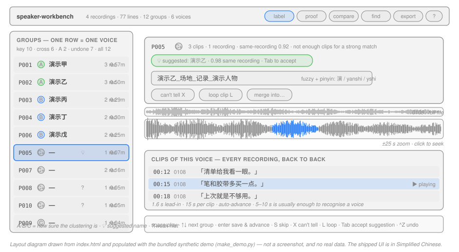
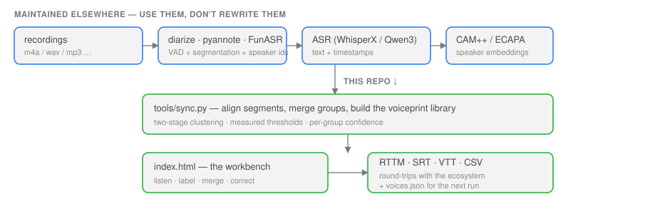
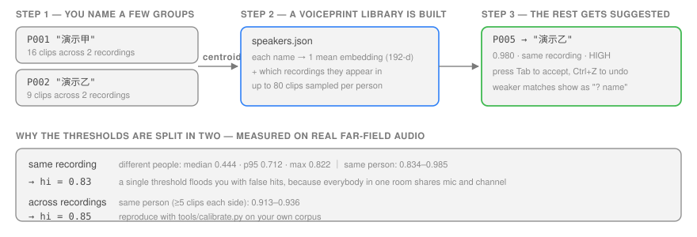

# speaker-workbench · 中文说明

> English: **[README.md](README.md)** —— 这份是中文版，章节与之一一对应。

**把 `SPEAKER_00 / SPEAKER_01` 变成真人名 —— 而且是跨整个录音库，不是一次一个文件。**

现成的说话人分离工具会给你匿名编号，而且**每个文件各自编号**。这个仓库做的是分离之后的下一步：把身份**跨录音对齐**，让人确认一次，然后让这些确认结果**自动去标记新录音**。



<sub>按 `index.html` 实际布局画的示意图（不是截图）。界面本身是简体中文；`认人 / 校对 / 对照` 是三个模式，不是三个独立工具。</sub>

---

## 为什么不直接用 pyannote / diarize / WhisperX？

假设你手上有同 10 个人的会议录音。`pyannote`、`diarize`、`WhisperX` 都会告诉你「第 3 份录音里有 4 个说话人」，但它们**不会**告诉你「第 3 份里的 2 号，和第 7 份里的 0 号是同一个人」，更不会告诉你那个人叫什么。

这个缺口不是疏忽，是公认未解决的问题。`diarize` 的作者把 *「Speaker identification — recognise known speakers across sessions using stored embeddings」* 写在 roadmap 上，并明确承认 *「一个真实的说话人可能被拆到多个 SPEAKER_XX 标签里，尤其是在嘈杂的真实音频上」*。

| | 单文件分离 | 跨录音身份归并 | 记住名字 | 免账号、离线 | 复核界面 |
|---|---|---|---|---|---|
| [`diarize`](https://github.com/FoxNoseTech/diarize) | ✅ 纯 CPU | ✗（roadmap） | ✗ | ✅ | ✗ |
| [`pyannote.audio`](https://github.com/pyannote/pyannote-audio) | ✅ | ✗ | ✗ | ✅（受限权重需 HF token） | ✗ |
| [`WhisperX`](https://github.com/m-bain/whisperX) | ✅（内部调 pyannote） | ✗ | ✗ | ✅（同样要 token） | ✗ |
| [`GECKO`](https://github.com/gong-io/gecko) | ✗ | ✗ | ✗ | ✅ | ✅（单文件；2025-11 已废弃） |
| [`audino`](https://github.com/readbeyond/audino) | ✗ | ✗ | ✗ | 自部署 | ✅（多人协作） |
| **speaker-workbench** | **✗ —— 上面几行就是干这个的** | **✅** | **✅** | ✅ | ✅ |

赌注是故意收窄的：其他几层都有人做得很好，最下面这一层没人做。所以整条管线是分工的，**只有最后一段是我们的**：



---

## 快速开始

全程离线、不需要账号。浏览器工作台**零依赖**（无构建、无 CDN、无框架）。

**不想装任何东西？** <https://icather.github.io/speaker-workbench/> —— 同一份合成语料，由本仓库静态托管。标注存在浏览器的 `localStorage` 里；「写回磁盘」那个接口只在本地运行时才存在。

```bash
git clone https://github.com/Icather/speaker-workbench.git && cd speaker-workbench

start.bat          # Windows
./start.sh         # macOS / Linux
```

| 你想做什么 | 需要什么 |
|---|---|
| 试试界面 | 浏览器 —— 或者直接开 [在线 demo](https://icather.github.io/speaker-workbench/) |
| 跑测试 | Node 18+，然后 `npm install`（唯一依赖是 jsdom） |
| 跑数据管线 | Python 3.9+、`numpy`，以及 `PATH` 里的 `ffmpeg`（`pypinyin` 可选，装上才有拼音搜索） |

仓库自带一份**完全合成的 demo**（假人物、程序合成的语音、自造对话，见 `tools/make_demo.py`）：4 份录音 / 77 句 / 12 组 / 6 个说话人，以 32 kbps mp3 提交。克隆下来直接就能把每个功能点一遍，**不需要 ffmpeg**。重新生成是**确定性的**：每次跑出来的音频、转写稿、声纹都完全一样。

它是**刻意提交进仓库**的 —— 这也正是 `audio/` 和 `data.js` 没有被 gitignore 的原因。克隆下来很方便；但如果你之后把管线指向**自己的语料**，这两个路径会被就地覆盖，紧接着一句 `git add .` 就会把你的真实录音暂存进去。`sync.py` 在覆盖前会先警告；详见 [CONTRIBUTING](CONTRIBUTING.md#developing-against-your-own-audio)。

> demo 是**故意不完美**的 —— 因为真实管线的输出本来就不完美：一个人横跨 4 份录音中的 3 份；4 个组是已命名者的碎片（这就是「合并」的用途）；2 个组只有 1 段、确实认不出来；还有 1 个人带着两个不同的原始编号，而某个编号又覆盖了两个不同的组。「建议名」的**两档置信度**都能看到：1 条高信 + 4 条弱提示。

---

## 它怎么工作

1. **切分** —— 分离这一步由你自己跑 `diarize` / `pyannote` / `FunASR`。它的输出变成本工具读取的转写稿：标准 SRT，每行前缀 `(Speaker N)`。
2. **切片 + 提声纹** —— 按字幕切成 2–12 秒的片段，编码成 192 维 **CAM++** 声纹（`iic/speech_campplus_sv_zh-cn_16k-common`，3D-Speaker，约 28 MB）。
3. **两阶段聚类** —— 先用 `complete` linkage 得到纯净小簇，再用 `centroid` linkage 合并这些簇。**单阶段实测行不通**：同一个人跨录音的**单段**只有 **0.579**，而最像的**异人**是 **0.567** —— 任何单一阈值都分不开。详见 [docs/METHOD.md](docs/METHOD.md) §2。
4. **认人，然后复用** —— 你在界面上确认身份；每个确认过的组会变成一条**质心声纹**存进 `speakers.json`，没认的组再去和这个库比对（`sync.py:build_enrollment()`）。

第 1、2 步**都可替换**：任何能产出上述转写格式的分离工具、任何每段输出定长向量的声纹模型都能接。数据格式见 [docs/METHOD.md](docs/METHOD.md) §1，用 `python tools/inspect_embs.py` 自检。

---

## 四个模式

### 1. 认人（主战场）

点一个声纹组，页面就把**这个声音在全部录音里的片段串起来连播**（1.6 秒前情 / 单段上限 15 秒 / 播完自动跳）。多数人听 5–10 秒就能认出来，所以连播 3–4 段基本就能定。

- 全键盘：`空格` 播放 · `↑↓` 切组 · `Enter` 保存并下一组 · `S` 跳过 · `X` 分不出 · `L` 单段循环 · **`Tab` 采纳建议**
- 姓名框**支持中文 + 拼音**：`演` / `ysj` / `yanshijia` 打出同一个人的候选，显示为 `名字_标签1_标签2…`
- 双层波形：全曲概览 + 当前片段 ±25 秒放大；点波形任意位置跳转
- 变速 0.75×–1.5×，听不清时慢放

### 2. 校对

逐句过一遍，点编号 chip（或按 `1`–`9`）改说话人。改动存在 `overrides` 里，**不动原始分组**，所以不会丢东西。

### 3. 对照

`⇄ 对照` 显示原始分离工具自己的编号，并高亮「它被我们分到了别处」的句子；`📊 对照分析` 给出双向交叉统计：一个编号被拆成几组（它把不同的人合成一个）、一个组横跨几个编号（标签跳跃）。

### 4. online enrollment（自动建议名）

你每认一个人，系统就把他的片段平均成**质心声纹**存进 `speakers.json`；下次同步时，还没认的组会去比对，够像就出建议名，`Tab` 一键采纳、`Ctrl+Z` 可撤。



**阈值是实测出来的，不是拍的**（`tools/calibrate.py` 可在你自己的数据上复现）：

| 场景 | 实测余弦 | 阈值 |
|---|---|---|
| 同一人 · 同一份录音 | 0.834 – 0.985 | 同场 `hi = 0.83` |
| **不同人 · 同一份录音**（n=675） | 中位 0.444，p95 0.712，**最大 0.822** | ← 分界 0.828 |
| 同一人 · 跨录音（两侧均 ≥5 段） | 0.913 – 0.936 | 跨场 `hi = 0.85` |
| 1–2 段的小组 | 到 0.80 也和真同人重叠 | **永远只给弱提示** |

> 为什么要两套阈值：同一份录音里所有人共用房间和麦克风，相似度**基线天生就高**。拿跨录音的标准去卡同录音，会瞬间被假阳性淹没（我们吃过这个亏：39 个建议全是错的）。

### 5. 导出与互操作

导出 **RTTM**（`pyannote` / `diarize` / Kaldi / NeMo 的通用交换格式）、SRT、VTT、CSV（带 BOM，Excel 不乱码）、TXT、Markdown，以及 `voices.json`；也能**导入**别人的 RTTM 来做对照。范围和格式可在对话框里选，带预览。

---

## 用你自己的录音

```bash
cp config.example.json config.json
```

```jsonc
{
  "recordings":  "/path/to/audio",           // .m4a .mp3 .wav .flac .ogg .aac .opus .wma
  "transcripts": "/path/to/transcripts",     // <同名>.moss.srt
  "voiceprint":  "/path/to/voiceprint-out",  // _final_map.json / _groups_final.json / _embs_all.npz
  "out":         "."
}
```

相对路径以仓库根为基准；`VOICE_DECK_RECORDINGS` 等环境变量可覆盖。**不给 `config.json` 就用内置 demo。**

### 管线需要的数据格式

| 文件 | 内容 |
|---|---|
| 音频 | 文件名里带日期（`20260105_…`）→ 自动成为录音 tag |
| `*.moss.srt` | 标准 SRT，每行前缀 `(Speaker N)` |
| `_final_map.json` | `{"<tag>\|<start>": "P001", …}` 段 → 组 |
| `_groups_final.json` | 每组的统计（段数 / 时长 / 出现录音 / 一致性） |
| `_embs_all.npz` | `emb`（N×192）+ `meta`（JSON 串）；**没有它也能用，只是没有建议名** |

第一次同步**之前**先跑 `python tools/inspect_embs.py`：它会逐项校验上面四类输入，并**指名道姓地告诉你是哪个键对不上** —— 这类错会静默失败，最后表现为「页面是空的」。

产出这些文件的参考管线（CAM++ 声纹 + 两阶段层次聚类）写在 **[docs/METHOD.md](docs/METHOD.md)**。

### 日常命令

```bash
python tools/make_demo.py     # 重新生成合成 demo
python tools/sync.py          # 重建 data.js + audio/（含建议名）  [需要 numpy + ffmpeg]
python tools/serve.py         # 本地服务（支持 HTTP Range），自动开浏览器
python tools/calibrate.py     # 在你自己的数据上实测建议名阈值
python tools/inspect_embs.py  # 同步前校验数据格式
npm test                      # 两个测试套件（约 140 项检查，需要 npm install）
npm run test:logic            # 只跑逻辑套件，不需要 jsdom
npm run test:dom              # 只跑真实 DOM 套件
```

两个测试套件都是**数据自适应**的 —— 断言的是不变量而不是固定数字，所以同一套测试在合成 demo 和真实语料上都能过。

---

## 能力边界（都是实测数字）

- **单段几乎没有身份信息**：跨录音同人**单段** 0.579，而最像的异人 0.567 —— 分布重叠，单段永远定不了案。
- **多段质心可用**：两侧都 ≥5 段时，跨录音同人 0.913–0.936。
- **小声/话少的人认不出**：只在某一场说了十几秒的人，别浪费时间。
- **音色相近的两个不同人分不开**：声纹回答的是「是不是同一个声音」，不是「这两个像的声音里是哪个」。必须人工听。
- **内容像 ≠ 同一人**：两个都在「主持、介绍同一个人」的组，实测只有 0.478。

所以工作流是**机器提议、人来决定**，UI 就围绕这一点做：一个键一次决策、处处可撤销、每条建议都带分数和置信档。

## 这些情况请用别的工具

| 你需要 | 用什么 |
|---|---|
| 检测重叠语音 | `pyannote` —— 本工具每段最多标一个说话人，这是继承自分离工具的 |
| 词级时间戳 | 整条管线都不产出 |
| 带账号的多用户协作标注 | [`audino`](https://github.com/readbeyond/audino) |
| 实时 / 流式分离 | 这里没有流式，每一步都是文件式的 |
| 托管服务 | 全部本地就是设计目标，见 [隐私](#隐私) |

## Roadmap

有意保持很短，而且基本是「把断言变成实测」：

- **第二个语料的阈值实测**：0.83 / 0.85 这组阈值来自**单一**语料（远场手机录音），可移植性没人验证过。你把自己的 `tools/calibrate.py` 输出贴出来就能定这件事。
- **换声纹模型的横向实测**：CAM++ 对中文强；ECAPA-TDNN / WeSpeaker / NeMo 在同一批素材上的数字会很有价值。
- **界面翻译**：目前只有简体中文，还没有字符串表。

---

## 致谢与相关工作

- [`diarize`](https://github.com/FoxNoseTech/diarize) —— CPU 分离，Apache-2.0；它自己承认的两个缺口正是本项目要补的
- [`GECKO`](https://github.com/gong-io/gecko)（Gong.io）—— 浏览器内分离标注器；「多系统对照」这个视图是照它做的
- [`audino`](https://github.com/readbeyond/audino)（MIT）—— 协作标注
- `Aegisub` / `Subtitle Edit` —— 字幕打轴的交互范式（波形、逐行快捷键、合并/拆分）
- [arXiv:2509.18377](https://arxiv.org/abs/2509.18377) —— speaker identification 的 *online enrollment* 做法
- `3D-Speaker` / CAM++ —— 参考管线用的中文声纹模型
- 方法细节与开源工具调研见 **[docs/METHOD.md](docs/METHOD.md)**、**[docs/FIELD-NOTES.md](docs/FIELD-NOTES.md)**

---

## 隐私

声纹是生物识别信息，转写稿是关于真人的。本工具设计上**全部本地**：服务只绑 `127.0.0.1`，音频不出机器，无遥测、无联网。

demo 里的音频是**程序合成的**、人名是**编的**（`tools/make_demo.py` 从零生成）。如果你 fork，请把真实录音和真实声纹留在本地。

## 许可

MIT，见 [LICENSE](LICENSE)。

运行依赖：`numpy`（BSD-3）、`pypinyin`（MIT）、`jsdom`（MIT，仅测试用）。`ffmpeg` 只有管线需要，单独授权（LGPL-2.1+ 或 GPL，取决于所用构建）。浏览器界面本身不加载任何外部资源。

## 参与贡献

见 [CONTRIBUTING.md](CONTRIBUTING.md)（英文）—— 它很短，说明了测试套件强制的两条规矩，以及为什么**任何阈值都不许在没有实测的情况下改动**。
